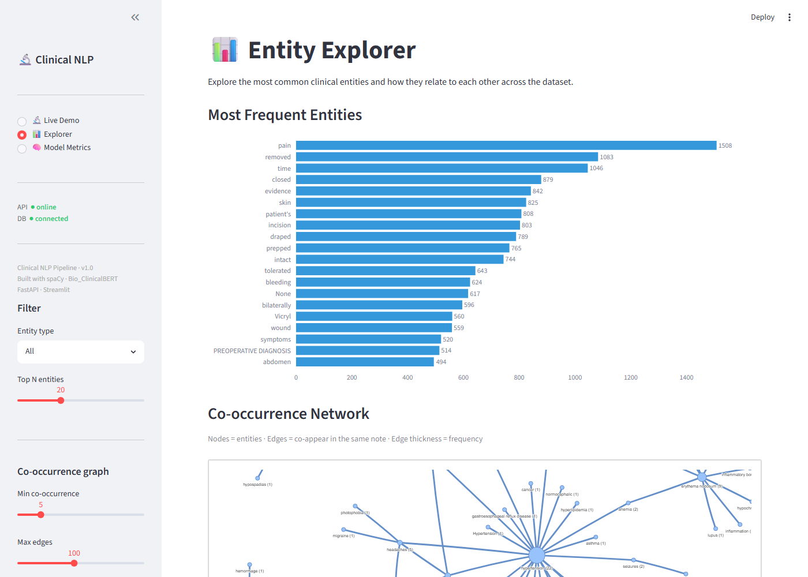
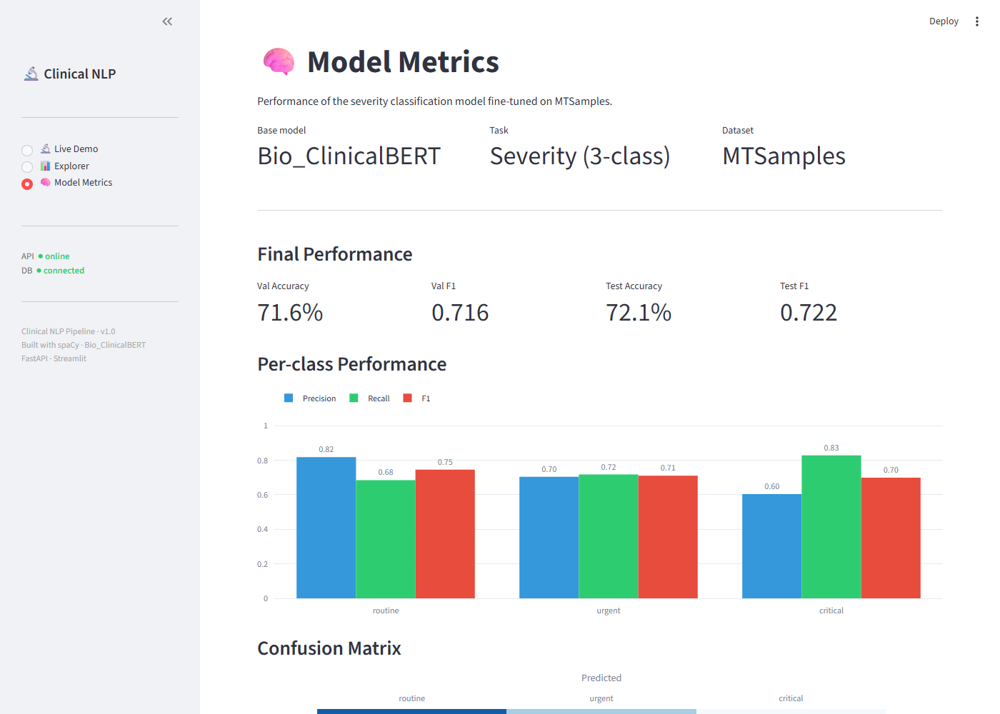

# Clinical NLP Pipeline

**NLP · Named Entity Recognition · Clinical Text Mining · BERT Fine-tuning**

A production-grade pipeline that extracts structured clinical knowledge
from unstructured medical notes using state-of-the-art biomedical NLP models.

[](https://github.com/<your-username>/clinical-nlp-pipeline/actions)

---

## What it does

| Component | What it does |
|-----------|-------------|
| **NER** | Extracts diagnoses, medications, procedures, symptoms, and anatomical terms using scispaCy (`en_core_sci_lg`) |
| **ICD-10 mapping** | Maps extracted entities to ICD-10-CM codes via exact → fuzzy → embedding matching |
| **Severity classifier** | Fine-tunes Bio_ClinicalBERT to classify notes as `routine`, `urgent`, or `critical` |
| **Co-occurrence graph** | Builds an interactive network of entity pairs that appear together in clinical notes |
| **FastAPI** | REST API serving all NLP functionality |
| **Streamlit demo** | Live public demo — paste any clinical note, get results in real time |

---

## Screenshots

| Live Demo | Entity Explorer |
|---|---|
|  |  |

| Model Metrics |
|---|
|  |

---

## Live demo

🔗 [clinical-nlp-pipeline.streamlit.app](https://clinical-nlp-pipeline.streamlit.app) *(deploy your own — see VSCODE_GUIDE.md)*

---

## Quick start

```bash
git clone https://github.com/<your-username>/clinical-nlp-pipeline
cd clinical-nlp-pipeline
python -m venv .venv && source .venv/bin/activate
pip install -r requirements-dev.txt

# Install the scispaCy NER model
pip install https://s3-us-west-2.amazonaws.com/ai2-s2-scispacy/releases/v0.5.3/en_core_sci_lg-0.5.3.tar.gz

# Download MTSamples from Kaggle → data/raw/mtsamples.csv
# Then run the pipeline
python -m src.etl.pipeline --dry-run
uvicorn src.api.main:app --reload &
streamlit run dashboard/app.py
```

Full step-by-step instructions: **[VSCODE_GUIDE.md](VSCODE_GUIDE.md)**

---

## Batch processing

Once the ETL pipeline has loaded notes into the database, these scripts
populate entities, ICD-10 mappings, and the severity classifier against
stored data. All three are idempotent and resumable — safe to interrupt
and re-run without creating duplicates:

```bash
python scripts/run_ner_batch.py                            # extract entities from stored notes
python scripts/run_icd10_batch.py                          # map DISEASE/SYMPTOM entities to ICD-10 codes
python scripts/train_severity_classifier.py --n-seeds 4    # fine-tune the severity classifier
```

Each accepts `--limit N` for a quick subset run. `run_icd10_batch.py`
also maintains an on-disk cache (`data/processed/icd10_mapping_cache.json`)
so a restart skips re-attempting entities already checked, matched or not.
`train_severity_classifier.py --n-seeds N` trains N different random
seeds and keeps only the one with the best critical-class F1 — small
fine-tuning runs are sensitive to initialisation, so a single unseeded
run isn't reliably comparable across retrains (default is 1, i.e. a
single run, if omitted).

---

## Tech stack

| Layer | Library |
|-------|---------|
| NER | spaCy + scispaCy `en_core_sci_lg` |
| Classification | HuggingFace Transformers + `Bio_ClinicalBERT` |
| ICD-10 fuzzy | rapidfuzz |
| ICD-10 embeddings | sentence-transformers |
| API | FastAPI + Pydantic |
| Database | SQLAlchemy (SQLite local / PostgreSQL cloud) |
| Dashboard | Streamlit |
| Visualisation | Plotly + NetworkX + pyvis |
| Testing | pytest (65 tests) |
| CI/CD | GitHub Actions |

---

## Project structure

```
src/
  utils/       config, logger, text cleaning utilities
  etl/         extract → transform → load pipeline
  nlp/         ner, icd_mapper, classifier, cooccurrence
  db/           connection, ORM models, repository layer
  api/          FastAPI app, Pydantic schemas, route handlers
dashboard/
  app.py        Streamlit entry point
  api_client.py typed HTTP client for the API
  pages/        demo, explorer, model_metrics
notebooks/
  00_data_exploration.ipynb
  01_ner_walkthrough.ipynb
  02_icd_mapping.ipynb
  03_classification.ipynb   ← fine-tune Bio_ClinicalBERT
  04_visualisation.ipynb
tests/          pytest test suite — 65 tests, 0 dependencies on GPU
sql/            schema.sql for Supabase migration
```

---

## Dataset

**MTSamples** — 4,999 de-identified medical transcriptions across 40 specialties.
Download free from [Kaggle](https://www.kaggle.com/datasets/tboyle10/medicaltranscriptions).

MIMIC-III discharge summaries are optionally supported (requires PhysioNet credentialing).

---

## Severity labels

MTSamples has no severity labels, so we derive them using weak supervision:

| Label | Signal |
|-------|--------|
| `critical` | ICU, ventilator, cardiac arrest, stroke, respiratory failure |
| `urgent` | Emergency, acute, admitted, infection, chest pain, unstable |
| `routine` | Elective, outpatient, follow-up, stable, screening |

The classifier learns to generalise beyond these keyword rules.

Current performance (Bio_ClinicalBERT, class-weighted loss, retrained
2026-07-16, best of 4 random seeds selected by critical-class F1):
~72% overall test accuracy/F1. Per-class breakdown on `critical` — the
safety-relevant class — is what matters most here: **precision 0.604,
recall 0.829, F1 0.699** (up from an unweighted-loss baseline of recall
0.486, F1 0.515). The loss is deliberately weighted to favour catching
critical cases over aggregate accuracy, since missing a true critical
note is far costlier than a false positive.

Fine-tuning a 3-class head on top of a pretrained model with a small
dataset is sensitive to random initialisation — an unseeded single run
can land anywhere from critical F1 0.54 to 0.70. `train_severity_classifier.py`
trains several seeds and keeps the best rather than trusting one
arbitrary run; see `--n-seeds` in Batch processing above. Full metrics (including a
confusion matrix and per-epoch history) are recorded in the
`model_runs` table and served at `GET /model/metrics` — the dashboard's
Model Metrics page reads from there, not a local file.

---

## Deployment

See **[VSCODE_GUIDE.md](VSCODE_GUIDE.md)** — Phase 8 covers:
- Supabase (free PostgreSQL for the database — use the *pooler*
  connection string, not the direct one; the direct host is IPv6-only
  and unreachable from several free-tier hosts)
- Hugging Face Spaces (free API hosting — has enough RAM for the full
  hybrid NER + classifier pipeline; Railway/Render are lighter-weight
  alternatives but Render's free tier specifically doesn't have enough
  memory for this project's models)
- Streamlit Cloud (free dashboard hosting)

Total cloud cost for a portfolio demo: **£0/month**.

---

## Running tests

```bash
pytest                              # all 65 tests
pytest --cov=src                    # with coverage
pytest tests/test_ner.py -v         # one file
```

---

## Author

Built by Ayodeji as part of a HealthTech Data Engineering portfolio.
